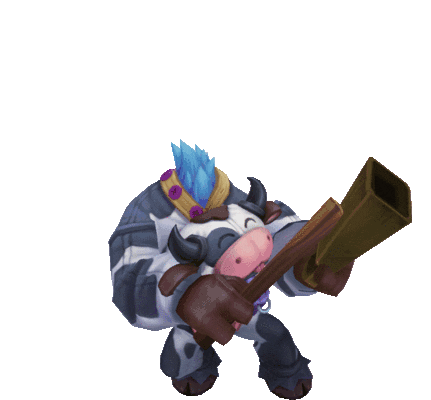

<h1>Hi 👋, I'm Juan</h1>

  

<h3 align="center">A passionate backend developer from México</h3>

- 🔭 I’m currently working on **a Laravel + MySQL ticket system**
- 🌱 I’m currently learning **API security, unit testing, and JS frontend**
- 📫 How to reach me: **juan.dev@example.com**

---

### 🛠️ Languages and Tools:

  <table>
    <tr>
      <td align="center">
        
         Laravel
      </td>
      <td rowspan="8">
        
      </td>
    </tr>
    <tr><td align="center"> MySQL</td></tr>
    <tr><td align="center"> PHP</td></tr>
    <tr><td align="center"> HTML</td></tr>
    <tr><td align="center"> CSS</td></tr>
    <tr><td align="center"> VS Code</td></tr>
    <tr><td align="center"> Git</td></tr>
    <tr><td align="center"> GitHub</td></tr>
  </table>

---

